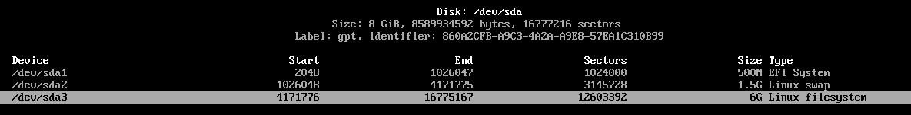

从镜像网站上 https://mirrors.ustc.edu.cn/ 获取映像文件

查看启动发生BIOS or UEFI
```shell
[ -d /sys/firmware/efi ] && echo UEFI || echo BIOS
```

创建磁盘分区：需要一个根分区和一个EFI系统分区

```shell
lsblk -l
lsblk -f
fdisk -l
```

以上三个命令均可查看。

> 结果中以 rom、loop 或者 airoot 结尾的设备可以被忽略。

可以使用 cfdisk 分区工具来进行分区表，也可以使用 fdisk 或 parted 修改分区表。

虚拟机分区实例：


格式化

```shell
mkfs.ext4 /dev/root_partition（根分区）
mkswap /dev/swap_partition（交换空间分区）
mkfs.fat -F 32 /dev/efi_system_partition（EFI 分区）
```

挂载分区

```shell
mount /dev/root_partition（根分区） /mnt
mount --mkdir /dev/efi_system_partition（EFI 系统分区） /mnt/boot
swapon /dev/swap_partition（交换空间分区）
```

安装

选择镜像
官方所有的镜像源：https://archlinux.org/download/
```shell
# 更新
pacman -Sy
# 安装reflector 
pacman -S reflector 
# 备份
cp /etc/pacman.d/mirrorlist /etc/pacman.d/mirrorlist.bk
# 选择最快的镜像源
reflector --verbose -l 200 -p https --sort rate --save /etc/pacman.d/mirrorlist
# 选择在中国的最快镜像源
reflector --verbose --country 'China' -l 200 -p https --sort rate --save /etc/pacman.d/mirrorlist
# 选择最快的镜像源
reflector --verbose -l 200 -p http --sort rate --save /etc/pacman.d/mirrorlist
# 查看
cat /etc/pacman.d/mirrorlist
```

文件 /etc/pacman.d/mirrorlist 定义了软件包会从哪个镜像下载。

安装必需的软件包

```shell
pacstrap -K /mnt base linux linux-firmware base-devel
```

配置系统

用以下命令生成 fstab 文件 (用 -U 或 -L 选项设置 UUID 或卷标)：
```shell
genfstab -U /mnt >> /mnt/etc/fstab
```

chroot 到新安装的系统：
```shell
arch-chroot /mnt
```

文本编辑器 vim

```shell
pacman -S vim
```

配置文字的编码
```shell
vim /etc/locale.gen 
```

输入`locale-gen`设置字符集

在文件 `/etc/locale.conf` 中写入 `LANG=en_US.UTF-8` 保存
```shell
echo LANG=en_US.UTF-8 > /etc/locale.conf
```

设置时区(以上海为例):
```shell
ln -sf /usr/share/zoneinfo/Asia/Shanghai /etc/localtime
```

运行`hwclock`以生成 `/etc/adjtime`
```shell
hwclock --systohc
```

网络配置
配置主机名:
```shell
echo yourname > /etc/hostname
```
以及配置密码
```shell
passwd
```

安装网络工具
```shell
pacman -S iw wpa_supplicant wireless_tools net-tools
```
安装NetworkManager管理网络
```shell
pacman -S networkmanager
```
启动和自启动 NetworkManager
```shell
systemctl start NetworkManager
systemctl enable NetworkManager
```

ssh
```shell
pacman -S openssh
```
启动和自启动 ssh
```shell
systemctl start sshd
systemctl enable sshd
```

新建用户
```shell
useradd -m yourname
```
设置密码
```shell
passwd yourname
```

配置sudo
```shell
chmod +w /etc/sudoers
```
修改`/etc/sudoers`,在 root ALL=(ALL) ALL 下加入一行 yourname ALL=(ALL) ALL

GRUB
```shell
pacman -S grub efibootmgr
vim /etc/default/grub # 取消 GRUB_DISABLE_OS_PROBER=false 前面的 #
```
对于UEFI
```shell
grub-install --target=x86_64-efi --efi-directory=boot --bootloader-id=GRUB
grub-mkconfig -o /boot/grub/grub.cfg
```
对于BIOS
```
grub-install --target=i386-pc /dev/sda
grub-mkconfig -o /boot/grub/grub.cfg
```
退出重启
```shell
exit
reboot
```

桌面环境

```shell
pacman -S sddm plasma konsole kate filelight dolphin ark
```

设置中文
```shell

```


打印环境变量
```shell
printenv
```