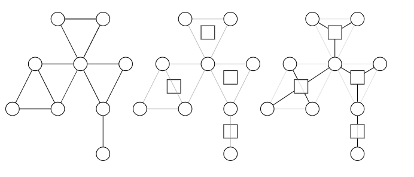

## 双连通分量

在一个无向连通图中，对于两个点 $u, v$ 如果删除任意一条边都不能使其不连通，则称 $u, v$ 边双连通。

> 在以 $u$ 为源点， $v$ 为汇点的网络流模型中，其具象化的表现为 $u \rightarrow v$ 的流量至少为 $2$。

在一个无向连通图中，对于两个点 $u, v$ 如果删除任意一个点都不能使其不连通，则称 $u, v$ 点双连通。

> 在以 $u$ 为源点， $v$ 为汇点的网络流模型中，通过对（非源、汇点）拆点的操作——每个点拆成中间连一条容量为 $1$ 的边，其具象化的表现为 $u \rightarrow v$ 的流量至少为 $2$。

- 点双连通图
    图上任意两个点 $u, v$ 都是点双连通的。一个近乎等价的定义——一张连通图上不存在割点（仅在两个点一条边的情况下实效）。

## 圆方树

将一张图分成 $k$ 个极大点双连通分量，每一个点双建一个方点，这个方点和该点双内的所有圆点连一条边（原图上的点成为圆点，每个点双创建的新的点称为方点）。

在圆方树中与多个方点所相连的圆点是原图上的割点。

下面是一张无向图转化为圆方树的形态。




### 例题

#### 2023 杭电多校2 1003 

[Counter Strike](https://acm.hdu.edu.cn/showproblem.php?pid=7289)

参考代码：

```cpp
#include<bits/stdc++.h>
using namespace std;
typedef long long ll;
typedef pair<int, int> PII;
const int INF = 1e9 + 7, MAXN = 2e5 + 10, mod = 998244353;
int n, m, k, cnt;
vector<int> gra[MAXN], tre[MAXN << 1];
int dfn[MAXN], low[MAXN], tim;
stack<int> stk;
void init() {
    for(int i = 0; i < n * 2; i ++) {
        tre[i].clear();
    }
    for(int i = 0; i < n; i ++) {
        dfn[i] = low[i] = -1;
    }
    tim = 0;
    cnt = n;
    while (!stk.empty()) {
        stk.pop();
    }
}
int Tarjan(int u, const vector<int>& del) {
    int res = (del[u] == 2);
    dfn[u] = low[u] = ++ tim;
    stk.push(u);
    for(int v : gra[u]) {
        if(dfn[v] == -1 && del[v] != 1) {
            res += Tarjan(v, del);
            low[u] = min(low[u], low[v]);
            if(low[v] == dfn[u]) {
                for(int x = 0; x != v; stk.pop()) {
                    x = stk.top();
                    tre[cnt].push_back(x);
                    tre[x].push_back(cnt);
                }
                tre[u].push_back(cnt);
                tre[cnt].push_back(u);
                cnt ++;
            }
        } else if(del[v] != 1) {
            low[u] = min(low[u], dfn[v]);
        }
    }
    return res;
}
PII dfs(int u, int f, const vector<int>& del) {
    int res = - 1, count = ((u < n) && (del[u] == 2));
    for(int v : tre[u]) if(v != f) {
        auto x = dfs(v, u, del);
        count += x.second;
        if(x.first != -1) {
            res = x.first;
        } else if(res == -1 && count >= 2) {
            res = u;
        }
    }
    return {res, count};
}
PII dfs2(int u, int f, const vector<int>& del) {
    int res = 0, count = ((u < n) && (del[u] == 2));
    for(int v : tre[u]) if(v != f) {
        auto x = dfs(v, u, del);
        count += x.second;
        res |= (x.second >= 2);
    }
    return {res, count};
}
void solve() {
    cin >> n >> m >> k;
    for(int i = 0; i < m; i ++) {
        int a, b;
        cin >> a >> b;
        a --, b --;
        gra[a].push_back(b);
        gra[b].push_back(a);
    }
    vector<int> h(k);
    for(int i = 0; i < k; i ++) {
        cin >> h[i];
        h[i] --;
    }
    int l = -1, r = k + 1;
    vector<int> del(n);
    auto check = [&](int m) -> bool {
        init();
        for(int i = 0; i < n; i ++) {
            del[i] = 0;
        }
        for(int i = 0; i < k; i ++) {
            if(i < m) {
                del[h[i]] = 1;
            } else {
                del[h[i]] = 2;
            }
        }
        int counter = 0;
        bool ok = true;
        for(int i = 0; i < n; i ++) if(dfn[i] == -1 && del[i] != 1) {
            int w = Tarjan(i, del);
            stk.pop();
            counter += (w >= 2);
            if(w > 2) {
                int X = dfs(i, i, del).first;
                if(X >= n) {
                    ok = false;
                } else {
                    ok = !dfs2(X, X, del).first;
                }
            }
            if(counter >= 2) {
                ok = false;
            }
            if(! ok) {
                break;
            }
        }
        return ok;
    };
    while(r - l > 1) {
        int m = l + r >> 1;
        if(check(m)) {
            r = m;
        } else {
            l = m;
        }
    }
    cout << r << '\n';
    for(int i = 0; i < n; i ++) {
        gra[i].clear();
    }
}
int main() {
    ios::sync_with_stdio(false);
    cin.tie(0);
    int _ = 1;
    cin >> _;
    while(_ --) {
        solve();
    }
}
```