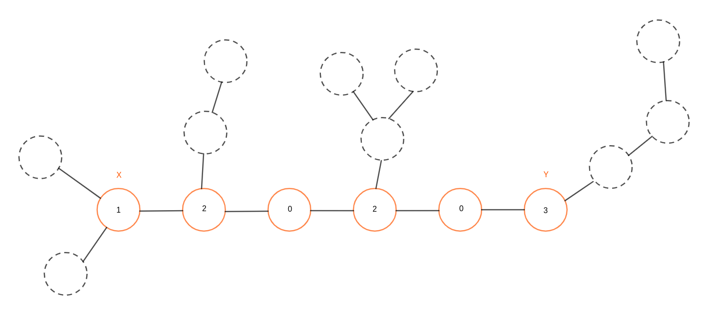
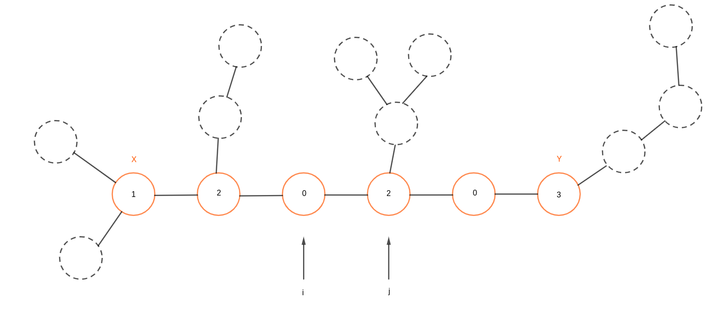
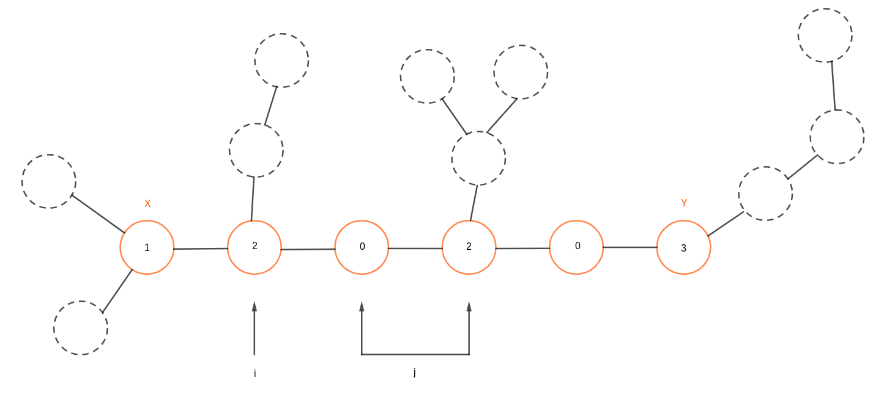

## 2023 杭电多校 7 1008

[HEX-A-GONE Trails](https://acm.hdu.edu.cn/showproblem.php?pid=7354)

**题目大意**

给定一棵无根树，两个玩家$(X, Y)$在上面移动，双方只能移动到与自己相邻且没有被任何玩家走过的节点，无法移动的玩家输掉游戏。

**题解**

首先需要对这个博弈模型进行一些化简，首先我们将 $X, Y$ 之间的路径标记出来，并求出这些路径上的点的价值，这里所谓的价值是以该点为根，不经过 $X, Y$ 路径上的边能够达的点的深度的最大值。例如下面这图能够如此化简：



现在用两个指针表示出两个玩家所在的位置，那么可以计算出两个玩家所获得的值（值为所在位置的值加上与初始点的距离的和），以及胜负关系（玩家一获得的值严格大于玩家而获得的值为胜）。



可以用当前局面的胜负关系来判断两个指针的移动方向，例如在上图的状态中，玩家一获得的值显然小于玩家二的值，那么如果玩家一想要胜利，那么 $i$ 指针就必须向靠近 $x$ 初始点的方向移动，那么玩家二的选择实际上就成了一个区间。



不断重复上述过程，直到两个指针移出被标记的点。

因为对于一个玩家来说，指针到达过的地方不会再次经过，因此可以用链表来维护 $i, j$ 两个指针的前驱和后继，区间的最值可以直接通过前缀得到，不需要数据结构。

时间复杂度 $O(n)$。

参考代码

```cpp
void solve() {
    int n;
    cin >> n;
    vector<vector<int>> tre(n);
    vector<int> path, col(n);
    int x, y;
    cin >> x >> y;
    x --, y --;
    for(int i = 0; i < n - 1; i ++) {
        int u, v;
        cin >> u >> v;
        u --, v --;
        tre[u].push_back(v);
        tre[v].push_back(u);
    }
    auto dfs = [&](auto self, int u, int f) -> bool {
        if(u == y) {
            path.push_back(u), col[u] = true;
            return true;
        }
        for(int v : tre[u]) if(v != f) {
            if(self(self, v, u)) {
                path.push_back(u), col[u] = true;
                return true;
            }
        }
        return false;
    };
    dfs(dfs, x, x);

    reverse(path.begin(), path.end());
    int w = path.size();
    
    vector<int> val(n), dep(n);
    auto get_v = [&](auto self, int u, int f) -> int {
        dep[u] = dep[f] + 1;
        int res = 0;
        for(auto v : tre[u]) if(v != f && !col[v]) {
            res = max(res, self(self, v, u));
        }
        res ++;
        return res;
    };
    for(int i : path) {
        val[i] = get_v(get_v, i, i);
    }
    
    int mxx = 0, mxy = 0, curx = 0, cury = w - 1;
    for(;curx  + 1 < cury;) {
        if(curx + 1 < cury) curx ++;
        if(cury - 1 > curx) cury --;
    }
    mxx = val[path[curx]] + curx;
    mxy = val[path[cury]] + w - 1 - cury;

    bool res = mxx > mxy;
    vector<int> nxtA(w, -1), preA(w, -1), nxtB(w, -1), preB(w, -1);
    for(int i = 0; i < w - 1; i ++) {
        nxtA[i] = i + 1;
        preB[i] = i + 1;
    }
    for(int i = w - 1; i >= 1; i --) {
        preA[i] = i - 1;
        nxtB[i] = i - 1;
    }
    auto del =[&] () {
        if(nxtA[curx] != - 1) preA[nxtA[curx]] = preA[curx];
        if(preA[curx] != - 1) nxtA[preA[curx]] = nxtA[curx];
        if(nxtB[cury] != - 1) preB[nxtB[cury]] = preB[cury];
        if(preB[cury] != - 1) nxtB[preB[cury]] = nxtB[cury];
    };
    while(cury != -1 && curx != -1) {
        if(res) {
            del();
            curx = nxtA[curx];
            cury = preB[cury];
            if(cury == -1) {
                break;
            }
            mxx = max(mxx, val[path[curx]] + curx);
            mxy = val[path[cury]] + w - 1 - cury;
        } else {
            del();
            cury = nxtB[cury];
            curx = preA[curx];
            if(curx == -1) {
                break;
            }
            mxx = val[path[curx]] + curx;
            mxy = max(mxy, val[path[cury]] + w - 1 - cury);
        }
        res = mxx > mxy;
    }
    cout << (res ? 1 : 0) << '\n';
}
```